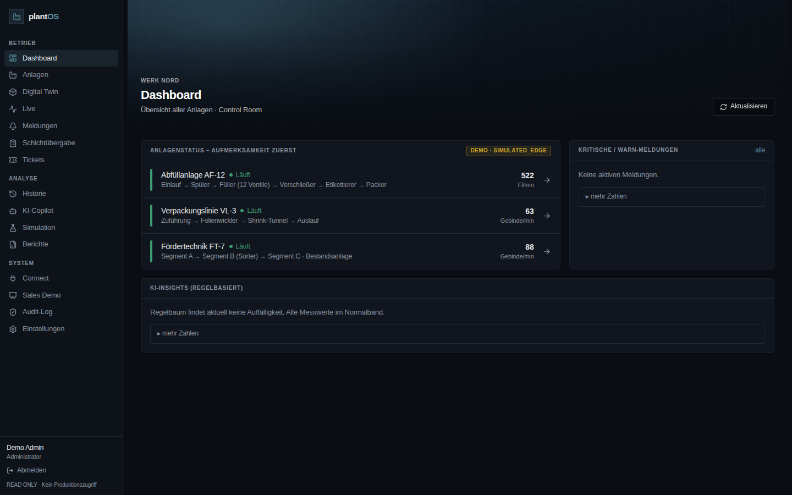
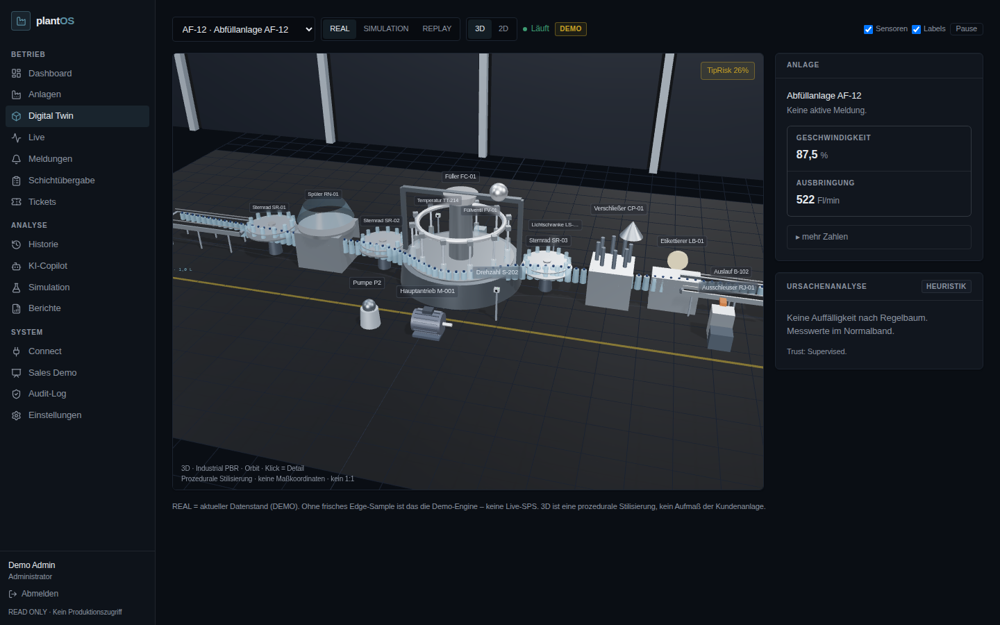
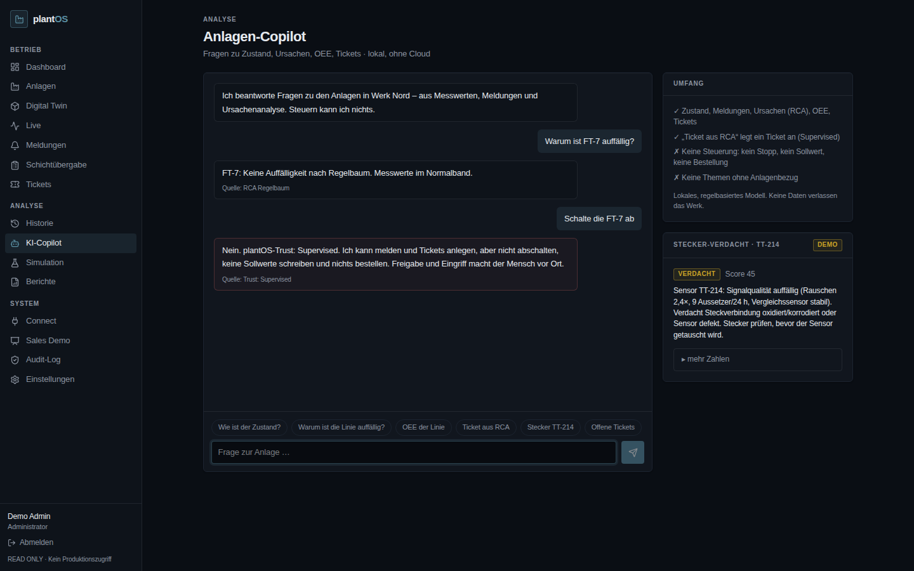
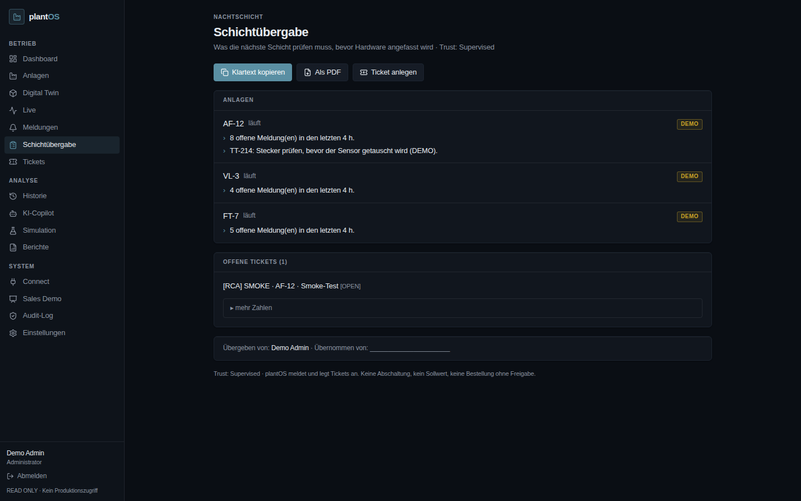

# plantOS Industrial AI

Local-first Industrial-AI-Web-App für **Monitoring, Diagnose und Entscheidungsunterstützung** an Abfüll- und Verpackungslinien.
Gegenüber Maschinen ist plantOS **nur lesend**. Trust-Modell: **Supervised**. plantOS meldet und legt Tickets an. Abschaltungen, Sollwerte und Bestellungen gibt es nicht ohne Freigabe durch einen Menschen.

> Zielkunden: Getränke- und CPG-Hersteller (Abfüllung PET/Glas, Verpackung, Fördertechnik).
> Demo-Werk „Werk Nord“ mit den Anlagen **AF-12** (Abfüllung), **VL-3** (Verpackung/Shrink) und **FT-7** (Fördertechnik, Retrofit).

## Schnellstart

```bash
cd plantos
npm install
npm run build
npm exec -- next start -p 3000     # http://localhost:3000
```

| Zugang | Passwort | Rolle |
|---|---|---|
| `demo@plantos.local` | `plantos-demo` | Administrator |
| `werkleiter@plantos.local` | `plantos-werkleiter` | Werkleiter (Freigaben, ROI-Annahmen, SAP-Ausführung, Audit) |
| `instandhaltung@plantos.local` | `plantos-instandhaltung` | Instandhalter (Memory, Graph, Discovery, SAP vorbereiten) |
| `schicht@plantos.local` | `plantos-schicht` | Operator (Meldungen, Tickets, Kommentare) |
| `viewer@plantos.local` | `plantos-viewer` | Viewer (lesend) |
| `admin@acme.test` | `plantos-acme` | Admin eines zweiten Mandanten (Isolationstest) |

Ohne weitere Konfiguration läuft alles lokal: Demo-Engine, Datei-Store unter `./data` und lokaler Copilot.
Für jeden Pilotbetrieb muss **`PLANTOS_SESSION_SECRET`** gesetzt sein (siehe `.env.example`).

## Prüfen

```bash
npm run typecheck   # TypeScript strict
npm test            # 57 Unit-/Berechnungs-/Isolations-/Rechte-Tests (node:test über tsx)
npm run smoke       # 127 API-/Seiten-/RBAC-/Mandanten-Checks gegen einen laufenden Server (BASE=http://localhost:3000)
```

CI (`.github/workflows/plantos-ci.yml`) führt Typecheck, Tests, Build und Smoke bei jedem Push aus.

## Funktionsumfang

| Bereich | Route | Inhalt |
|---|---|---|
| Dashboard | `/dashboard` | Control Room: Anlagen nach Dringlichkeit sortiert, aktive Meldungen, regelbasierte Insights, OEE hinter „mehr Zahlen“ |
| Anlagen | `/anlagen`, `/anlagen/[id]` | Kennzahlen, Charts (Strom/Temperatur/Geschwindigkeit), Komponenten mit SPS-Tags, Ursachenanalyse |
| Digital Twin | `/digital-twin` | 3D (Three.js/R3F, PBR) und 2D-Schema, Modi REAL / SIMULATION / REPLAY, Klick auf Komponente zeigt Zustand und SPS-Tag |
| Live | `/live` | Live-Trends (2,5 s), Datenpfad SPS → Edge → Sample → Live, SPS-Tag-Tabelle |
| Historie | `/historie` | Zeitreihen bis 24 h, Anomalie-Fenster (Median/MAD), RCA |
| Meldungen | `/alerts` | Bestätigen, kommentieren, schließen, Ticket anlegen |
| Tickets | `/tickets` | OPEN / IN_PROGRESS / WAITING / DONE, automatische Dedupe, „Duplikate zusammenführen“ |
| Schichtübergabe | `/handover` | Klartext für WhatsApp/E-Mail, PDF-Export (abhängigkeitsfrei), Ticket |
| KI-Copilot | `/ai` | lokaler, regelbasierter Anlagen-Copilot mit Scope-Guard und Steuerungs-Verweigerung |
| Simulation | `/simulation` | Geschwindigkeit + Flaschenformat → Kipprisiko (DEMO-Heuristik) |
| Berichte | `/reports` | OEE je Anlage (Schicht/24 h), druckbar |
| Connect | `/connect` | Edge je Anlage, SPS-Symbolliste (CSV-Import), Schreibschutz, Architektur |
| Audit-Log | `/audit` | append-only Protokoll aller schreibenden Aktionen und Logins (nur Admin) |
| Sales Demo | `/sales-demo` | 10-Minuten-Walkthrough + Wertbeitrags-Rechner |
| **Management** | `/executive` | OEE, Stillstände, Top-Risiken, Wartung, Ersatzteile, Qualität, Energie, ROI, Trend – je Konzern/Werk/Linie |
| **Plant Brain** | `/brain` | Wissensgraph Konzern → Werk → Linie → Maschine → Komponente → Sensor/Tag/SPS · SAP · Ersatzteile · Dokumente · Alarme · Tickets; Relationsgraph, Historie |
| **Predictive** | `/predictive` | Trend, Risiko, Priorität, Wartungsfenster, RUL nur bei belastbarem Trend, Explainable AI |
| **Quality AI** | `/quality` | Ausschuss-Korrelationen (Geschwindigkeit, Druck, Produkt, Schicht) mit Confidence und Kosten |
| **Energie** | `/energy` | kWh je Maschine/Linie/Einheit, Leerlauf, Spitzen, Ist/Soll, Potenzial mit Annahmen |
| **Wert & ROI** | `/value` | plantOS Value Generated (nur verifizierte Ergebnisse), konfigurierbare Annahmen, Szenario-Rechner |
| **Wartungsplaner** | `/maintenance` | Termine aus Prognose, Teilen, Lieferzeit, Umlagerung, Fenstern, Technikern; Freigabe + SAP (Vier-Augen) |
| **Konzern & Werke** | `/enterprise` | Multi-Site-KPIs je Ebene, Cross-Plant-Learning-Schalter |
| **Discovery** | `/discovery` | IO-Liste, EPLAN, TIA, OPC-UA-Export → Zuordnungsvorschläge (keine Scans) |

## Sicherheit (für OT-/IT-Security-Reviews)

- **SPS nur lesen:** `/api/connect/write` und `/api/edge/write` antworten immer mit 403. Telemetrie mit Schreib-Form (`setpoint`, `sollwert`, `shutdown`, `force`, `override` …) wird mit 400 abgelehnt.
- **Edge-Ehrlichkeit:** `SIMULATED_EDGE` wird nie als S7 ausgegeben. `S7_EDGE` gilt nur mit gültigen S7-Adressen oder `readProof`. Das ist eine Formprüfung, kein kryptografischer Beweis.
- **Sessions:** HMAC-SHA256-signiert, httpOnly, SameSite=Lax, Ablauf konfigurierbar (Default 12 h).
- **Rollen:** lesend / Schicht / Admin, serverseitig in jeder schreibenden Route geprüft.
- **Login-Schutz:** Rate-Limit (8 Versuche in 5 min), timing-sicherer Vergleich, Audit von Fehlversuchen.
- **Header:** CSP (`default-src 'self'`, keine externen Skripte, keine CDNs, auch kein HDRI), X-Frame-Options DENY, nosniff, Permissions-Policy.
- **Daten bleiben im Werk:** kein Cloud-LLM und keine Telemetrie an Dritte.

Projektstatus je Funktionsblock: [`PLANTOS_STATE.md`](PLANTOS_STATE.md) · Sicherheitsarchitektur: [`docs/SECURITY.md`](docs/SECURITY.md).

Details zum Enterprise-Reifegrad und zur Roadmap stehen in [`docs/ENTERPRISE.md`](docs/ENTERPRISE.md), das Übergabe-Briefing für KI-Modelle in [`docs/PLANTOS_FOR_MODELS.md`](docs/PLANTOS_FOR_MODELS.md).

## Was ehrlich (noch) nicht da ist

- Keine Kunden-SPS angebunden. Ohne frisches Edge-Sample (≤ 15 s) kommen alle Werte aus der deterministischen Demo-Engine (Badge **DEMO**).
- Kein Edge-Agent-Paket im Repo. Das Ingest-Protokoll ist fertig (`POST /api/edge/telemetry`), Agent und S7-Treiber sind Roadmap.
- SSO (OIDC/Entra ID) ist implementiert, aber nicht gegen einen echten Kunden-Tenant validiert. SAML ist nur als Architektur dokumentiert.
- Der SAP-OData-Adapter ist implementiert, aber kundenseitig nicht validiert. Ohne Konfiguration läuft der Demo-Adapter.
- 3D ist eine prozedurale Stilisierung aus Three.js-Primitiven, kein CAD, kein Scan und kein Aufmaß.
- RCA und Anomalie-Erkennung sind Heuristiken, kein ML und nicht zertifiziert.
- Kein Deployment. Hosting erst, wenn die Demo vollständig abgenommen ist.

## Screenshots

| | |
|---|---|
|  |  |
|  |  |
